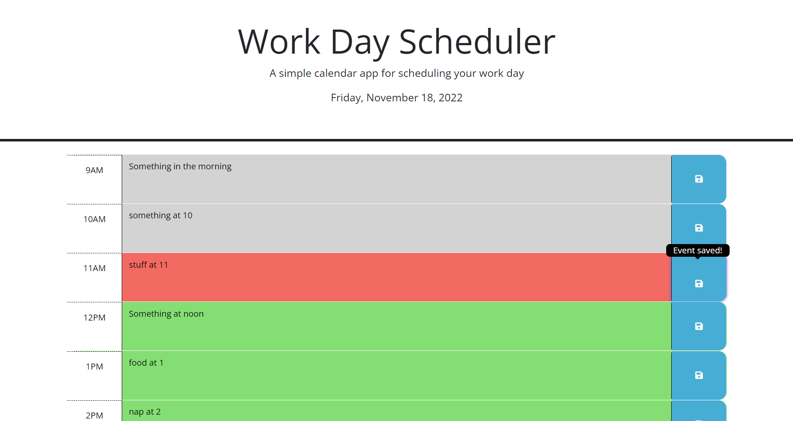

# Work Day Schedule

## Description
This website allows users to log events by the hour for the current day within a regular 9 to 5 work schedule.

## Installation
Load the website on a web browser using the following link: https://monysary.github.io/Work-Day-Schedule/

## Usage
This website displays the current date in the header and time blocks between the hours of 9AM to 5PM only for that current day.

The background colors of the time blocks will reset every second and turn grey for past hours, red for current hour, and green for future hours. Users can log their events in the text area and click the save button to the right of the respective text area to save the event. A tooltip will appear over the button to confirm that the event has been saved.

To clear the events, the user must delete the event entry and click save. Saved events persist even after a new day has started, meaning events need to be manually updated if the user has a different event for the day. This is because the saved events are stored in local storage.

## Credits
N/A

## License
N/A